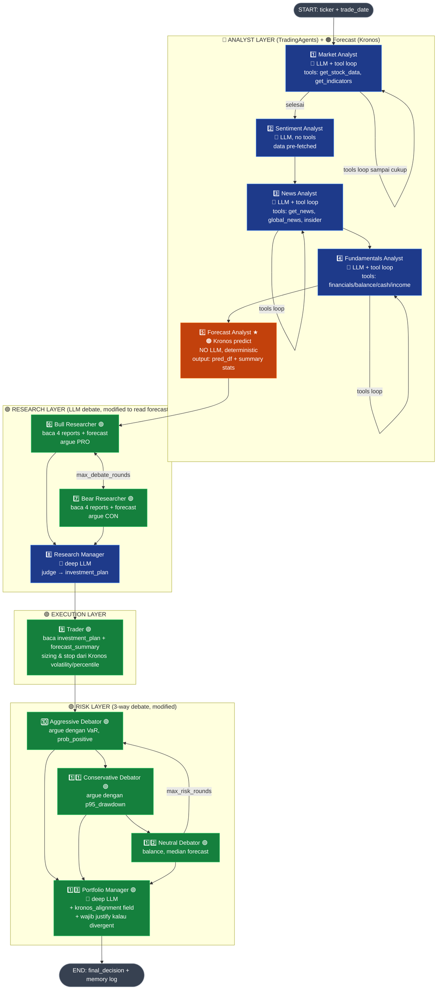
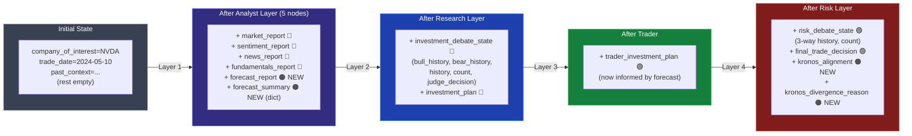
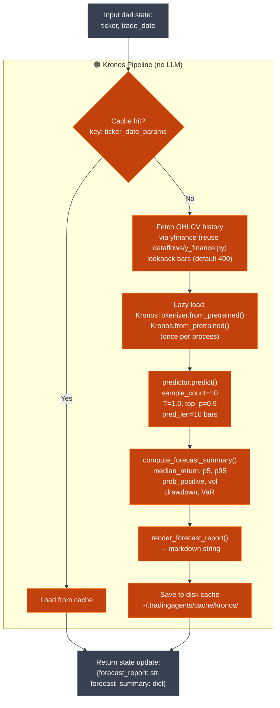
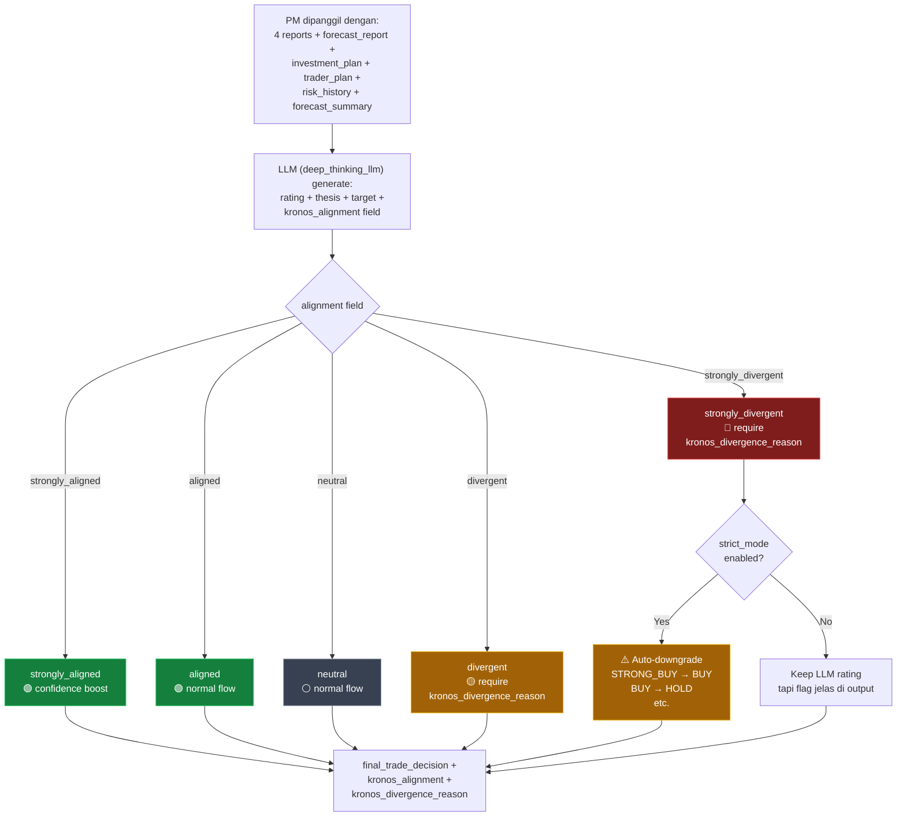
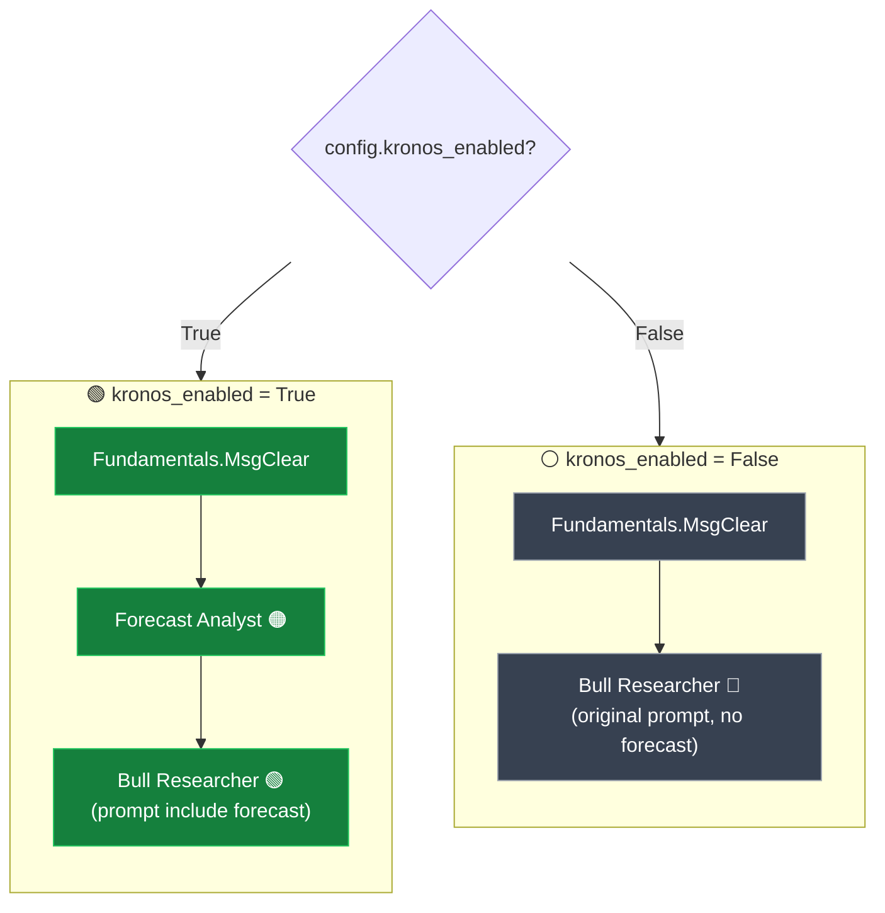
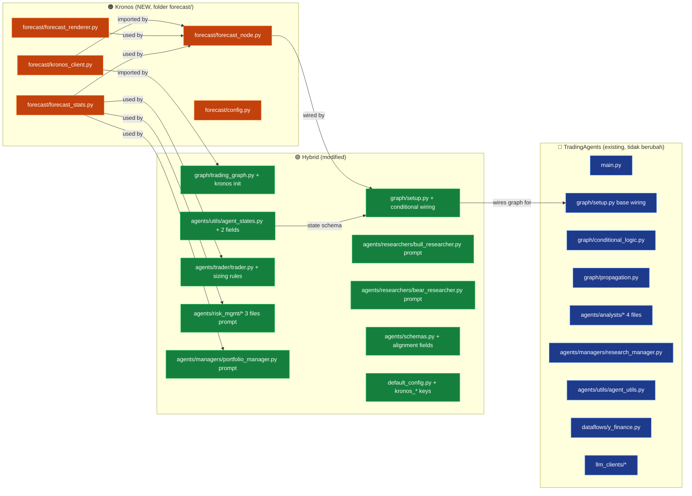
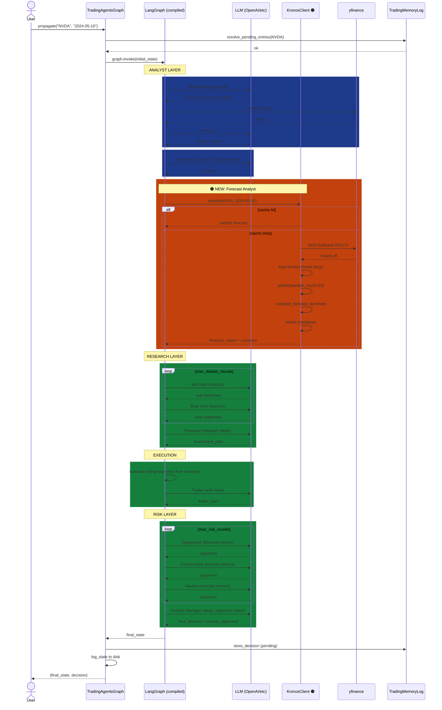
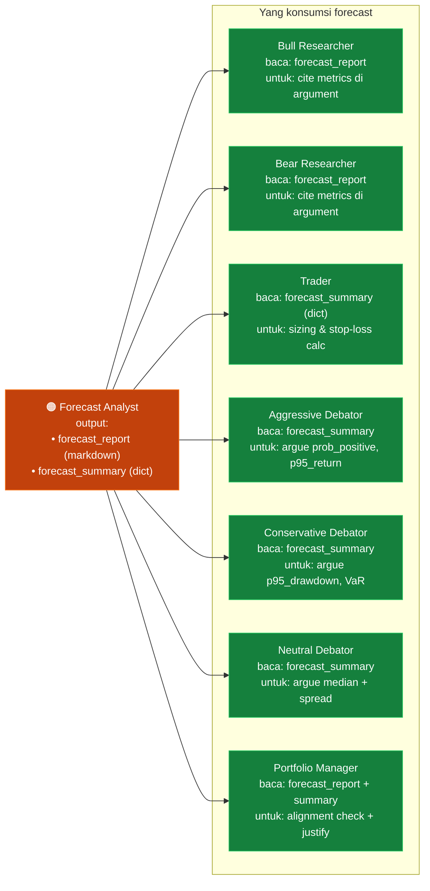

# TradingAgents × Kronos — Flow Diagrams

> Diagram-diagram Mermaid lengkap dengan anotasi sumber logic. Render otomatis di GitHub atau Markdown viewer mana saja yang support Mermaid.

---

## Legenda Warna

- 🔵 **Biru** = TradingAgents (LLM-driven, sudah ada)
- 🟠 **Oranye** = Kronos (forecast model, baru)
- 🟢 **Hijau** = Hybrid (TradingAgents existing TAPI dimodifikasi untuk consume Kronos)
- ⚪ **Abu-abu** = Infrastructure (state, edges, config)

---

## 1. Flow Utama End-to-End

Ini gambaran besar urutan eksekusi:



**Catatan:**
- Node `1-4` 100% TradingAgents existing — tidak diubah
- Node `5` (Forecast Analyst) 100% Kronos — tidak ada LLM call di sini
- Node `6-7, 9-13` adalah TradingAgents tapi **prompt/logic-nya dimodifikasi** untuk membaca output Kronos
- Node `8` (Research Manager) tidak diubah — dia membaca debate yang sudah di-inform oleh Kronos
- Loop di Market/News/Fundamentals = tool-calling loop (LangGraph conditional edge)
- Loop Bull↔Bear dan Risk debate = counter-based conditional edge

---

## 2. Detail State Mutation

Bagaimana state berubah di setiap layer (siapa nulis apa):



**Penjelasan field source:**

| Field State | Sumber Logic | Kategori |
|---|---|---|
| `market_report` | Market Analyst (LLM) | 🔵 TradingAgents |
| `sentiment_report` | Sentiment Analyst (LLM + pre-fetched data) | 🔵 TradingAgents |
| `news_report` | News Analyst (LLM) | 🔵 TradingAgents |
| `fundamentals_report` | Fundamentals Analyst (LLM) | 🔵 TradingAgents |
| `forecast_report` | Forecast Analyst (Kronos.predict + renderer) | 🟠 Kronos |
| `forecast_summary` | forecast_stats.compute_forecast_summary() | 🟠 Kronos |
| `investment_debate_state` | Bull + Bear Researcher (LLM, prompt include forecast) | 🟢 Hybrid |
| `investment_plan` | Research Manager (LLM, deep) | 🔵 TradingAgents |
| `trader_investment_plan` | Trader (LLM + sizing rules dari forecast_summary) | 🟢 Hybrid |
| `risk_debate_state` | 3 risk debaters (LLM, prompt include forecast metrics) | 🟢 Hybrid |
| `final_trade_decision` | Portfolio Manager (LLM, deep, + alignment check) | 🟢 Hybrid |
| `kronos_alignment` | Portfolio Manager (LLM structured output) | 🟠 Kronos-driven field |
| `kronos_divergence_reason` | Portfolio Manager (LLM, conditional on alignment) | 🟠 Kronos-driven field |

---

## 3. Detail Forecast Analyst Internal

Apa yang terjadi di dalam node Forecast Analyst (zoom-in):



**Karakteristik node ini:**
- Tidak ada LLM call → cepat (~1-3s GPU, ~5-15s CPU first time, instant kalau cache hit)
- Deterministic untuk seed yang sama (kalau set `T=0` atau cache)
- Tidak update `messages` (langsung skip Msg Clear)
- Dipanggil hanya kalau `config["kronos_enabled"] = True`

---

## 4. Conflict Resolution (LLM vs Kronos)

Decision logic di Portfolio Manager:



**Threshold untuk classify alignment** (di `forecast_stats.py`):

| Alignment | Kondisi |
|---|---|
| `strongly_aligned` | Direction sama + median \|return\| > 3% + prob_positive selaras (>65% kalau bull, <35% kalau bear) |
| `aligned` | Direction sama + magnitude moderate |
| `neutral` | Salah satu close to zero (median return between -1% to +1%) |
| `divergent` | Direction beda + magnitude moderate |
| `strongly_divergent` | LLM=STRONG_BUY tapi p95_return < 0; atau LLM=STRONG_SELL tapi p5_return > 0 |

---

## 5. Conditional Flow: Kronos On vs Off

Bagaimana graph wiring berbeda berdasarkan config:



**Implementasi di `setup.py`:**
```python
if self.config.get("kronos_enabled"):
    workflow.add_node("Forecast Analyst", forecast_node)
    workflow.add_edge(last_analyst_clear, "Forecast Analyst")
    workflow.add_edge("Forecast Analyst", "Bull Researcher")
else:
    workflow.add_edge(last_analyst_clear, "Bull Researcher")
```

---

## 6. Komponen Source Map

Mapping file ke sumber logic:



**Ringkasan effort per kategori:**

| Kategori | Jumlah file | Effort |
|---|---|---|
| 🔵 TradingAgents existing (tidak berubah) | ~25 | 0 (cuma reuse) |
| 🟠 Kronos baru | 5 | ~3-4 hari (Phase 1-2) |
| 🟢 Hybrid (modified) | 10 | ~5-7 hari (Phase 3-5) |
| **Total integrasi** | 15 file (5 baru + 10 modified) | **~10-14 hari** |

---

## 7. Sequence Diagram: 1 Run Lengkap

Timeline dari user invoke sampai output:



**Highlight:**
- Box biru tua = TradingAgents original
- Box oranye = Kronos NEW (single insertion point)
- Box hijau = LLM call dengan prompt yang dimodifikasi (input + forecast)

---

## 8. Data Flow: Bagaimana Forecast Dikonsumsi

Visualisasi bagaimana 1 forecast (output Kronos) dipakai oleh banyak downstream agent:



**Insight:** 1 forecast → 7 consumers. Cost amortized: meskipun Kronos predict mahal (~1-3s), hasilnya dipakai di 7 tempat. Sangat efisien.

---

## Penutup

Total ada **8 diagram** di dokumen ini:

1. **Flow utama end-to-end** — keseluruhan pipeline
2. **Detail state mutation** — apa yang berubah di setiap layer
3. **Forecast Analyst internal** — zoom-in ke node Kronos
4. **Conflict resolution** — decision tree alignment
5. **Conditional flow on/off** — kalau Kronos disabled
6. **Komponen source map** — file mana milik siapa
7. **Sequence diagram** — timeline 1 run
8. **Data flow forecast consumption** — siapa baca apa

**Cara render:**
- Buka di GitHub langsung — Mermaid auto-render
- VS Code dengan extension "Markdown Preview Mermaid Support"
- Obsidian, Typora, atau viewer lain yang support Mermaid
- Kalau cuma plain markdown viewer, akan tampak sebagai code block

**Untuk implementasi:** Diagram 1 (urutan node) dan diagram 6 (file map) yang paling sering kamu rujuk pas coding.
